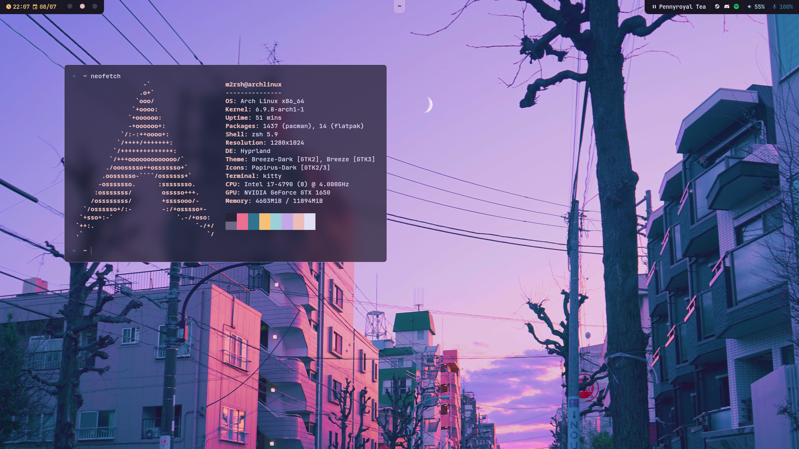
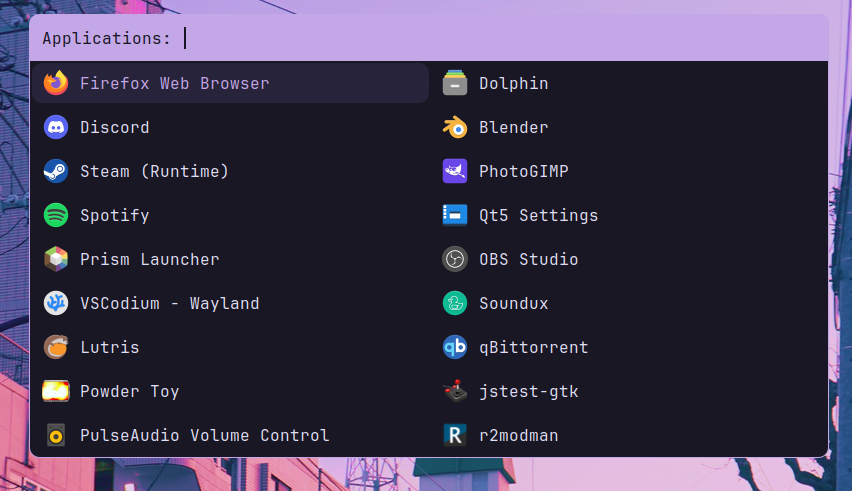
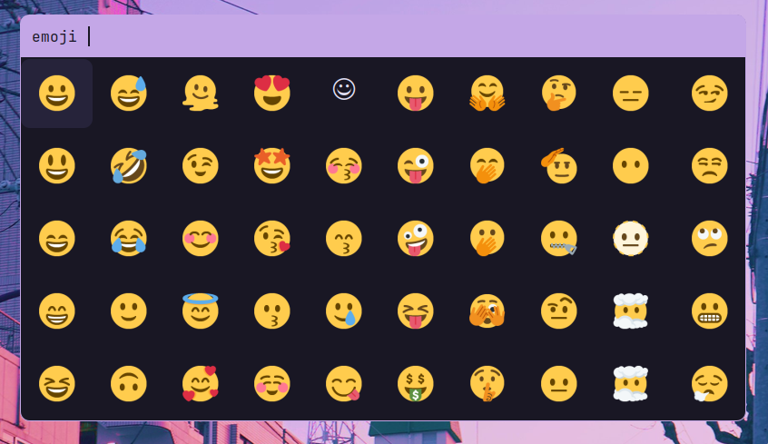
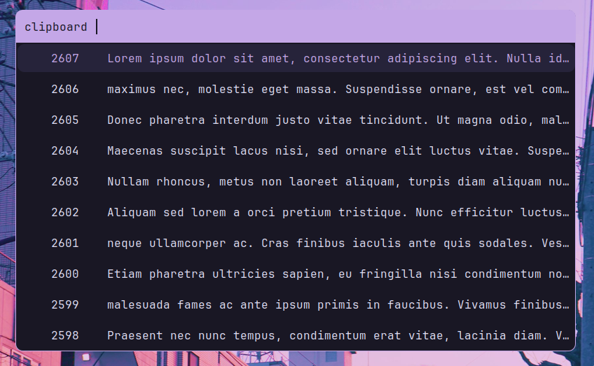
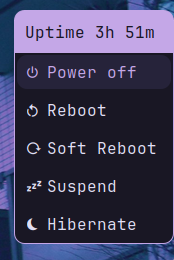
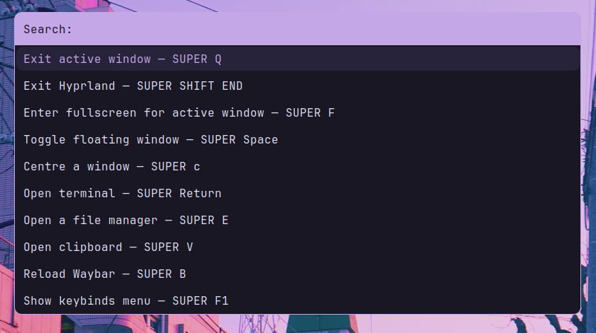

<div align="center">

# My Hyprland dotfiles

</div>

### Work in Progress screenshots may be a bit different
Laptops are not fully supported (No battery, WiFi, bluetooth etc. in waybar)

- [x] [Hyprland](https://github.com/hyprwm/Hyprland)
- [x] [Waybar](https://github.com/Alexays/Waybar)
- [x] [Hyprlock](https://github.com/hyprwm/hyprlock/)
- [x] [Kitty](https://sw.kovidgoyal.net/kitty/)
- [x] [Rofi](https://github.com/davatorium/rofi)
- [x] [Dunst](https://github.com/dunst-project/dunst)

[Go to installation](#installation)

<details open>
<summary>Showcase</summary>
<div align="center">

### Hyprtrails
Too lazy to update the gif (Read: Coming soon (never))

### Application Launcher


### Emoji Picker


### Clipboard Manager


### Power Menu


### Help menu

it updates automatically btw

## Waybar

### Clock/Calendar
<p align="left">
Hover -> Expand callendar <br/>
Scroll -> Next/Previous month <br/>
</p>

### Workspaces Indicator
<p align="left">
Left click -> Move to the corresponding workspace <br/>
Scroll -> Move through workspaces <br/>
</p>

### Window name
<p align="left">
Icons 😍 (On some programs. You can add your own in ~/.config/waybar/config.jsonc)
</p>

### Media Controller
<p align="left">
Scroll -> Next/Previous media <br/>
Left click -> Pause/Play <br/>
Middle click -> Pause/Play Spotify <br/>
Hover -> Info about playing media <br/>
</p>

### Volume/Microphone Controller
<p align="left">
Scroll -> Volume Up/Down <br/>
Left click -> Mute <br/>
</p>

</div>

</details>
<details open>
<summary>Keybinds</summary>
<br/>

| Keybind | Dispatcher | Command | Comments |
|---------|------------|---------|----------|
| <kbd>SUPER Q</kbd> | killactive  |  | Exit active window |
| <kbd>SUPER SHIFT END</kbd> | exit  |  | Exit Hyprland |
| <kbd>SUPER F</kbd> | fullscreen  |  | Enter fullscreen for active window |
| <kbd>SUPER Space</kbd> | togglefloating  |  | Toggle floating window |
| <kbd>SUPER c</kbd> | exec | hyprctl dispatch centerwindow  | Centre a window |
| <kbd>SUPER Return</kbd> | exec | kitty  | Open terminal |
| <kbd>SUPER E</kbd> | exec | dolphin  | Open a file manager |
| <kbd>SUPER V</kbd> | exec | killall rofi \|\| ~/.config/rofi/clipboard.sh  | Open clipboard |
| <kbd>SUPER B</kbd> | exec | killall waybar \|\| waybar  | Reload Waybar |
| <kbd>SUPER F1</kbd> | exec | killall rofi \|\| ~/.config/rofi/keybinds.sh  | Show keybinds menu |
| <kbd>SUPER D</kbd> | exec | killall rofi \|\| ~/.config/rofi/launcher.sh  | Application launcher |
| <kbd>SUPER period</kbd> | exec | killall rofi \|\| ~/.config/rofi/emoji.sh  | Emoji picker |
| <kbd>SUPER SHIFT L</kbd> | exec | killall rofi \|\| ~/.config/rofi/powermenu.sh  | Power menu |
| <kbd>CTRL ALT L</kbd> | exec | swaylock  | Lock screen |
| <kbd>SUPER 1</kbd> | workspace | 1  | Go to workspace 1 |
| <kbd>SUPER 2</kbd> | workspace | 2  | Go to workspace 2 |
| <kbd>SUPER 3</kbd> | workspace | 3  | Go to workspace 3 |
| <kbd>SUPER 4</kbd> | workspace | 4  | Go to workspace 4 |
| <kbd>SUPER 5</kbd> | workspace | 5  | Go to workspace 5 |
| <kbd>SUPER 6</kbd> | workspace | 6  | Go to workspace 6 |
| <kbd>SUPER 7</kbd> | workspace | 7  | Go to workspace 7 |
| <kbd>SUPER 8</kbd> | workspace | 8  | Go to workspace 8 |
| <kbd>SUPER 9</kbd> | workspace | 9  | Go to workspace 9 |
| <kbd>SUPER 0</kbd> | workspace | 10  | Go to workspace 10 |
| <kbd>SUPER ALT right</kbd> | workspace | e+1  | Move workspace forward |
| <kbd>SUPER ALT left</kbd> | workspace | e-1  | Move workspace backwards |
| <kbd>SUPER SHIFT 1</kbd> | movetoworkspace | 1  | Move a window to workspace 1 |
| <kbd>SUPER SHIFT 2</kbd> | movetoworkspace | 2  | Move a window to workspace 2 |
| <kbd>SUPER SHIFT 3</kbd> | movetoworkspace | 3  | Move a window to workspace 3 |
| <kbd>SUPER SHIFT 4</kbd> | movetoworkspace | 4  | Move a window to workspace 4 |
| <kbd>SUPER SHIFT 5</kbd> | movetoworkspace | 5  | Move a window to workspace 5 |
| <kbd>SUPER SHIFT 6</kbd> | movetoworkspace | 6  | Move a window to workspace 6 |
| <kbd>SUPER SHIFT 7</kbd> | movetoworkspace | 7  | Move a window to workspace 7 |
| <kbd>SUPER SHIFT 8</kbd> | movetoworkspace | 8  | Move a window to workspace 8 |
| <kbd>SUPER SHIFT 9</kbd> | movetoworkspace | 9  | Move a window to workspace 9 |
| <kbd>SUPER SHIFT 0</kbd> | movetoworkspace | 10  | Move a window to workspace 10 |
| <kbd>SUPER mouse:272</kbd> | movewindow  |  | (Left mouse button) Move a window |
| <kbd>SUPER mouse:273</kbd> | resizewindow  |  | (Right mouse button) Resize a window |
| <kbd>SUPER mouse_down</kbd> | workspace | e+1  | (Scroll down) Move one workspace forward |
| <kbd>SUPER mouse_up</kbd> | workspace | e-1  | (Scroll up) Move one workspace backwards |
| <kbd>XF86AudioMute</kbd> | exec | pamixer -t  | Mute button on your keyboard |
| <kbd>XF86AudioRaiseVolume</kbd> | exec | pamixer -i 5 --allow-boost --set-limit 150 && canberra-gtk-play -i audio-volume-change  | Volume up button on your keyboard |
| <kbd>XF86AudioLowerVolume</kbd> | exec | pamixer -d 5 --allow-boost --set-limit 150 && canberra-gtk-play -i audio-volume-change  | Volume down button on your keyboard |
| <kbd>SUPER  XF86AudioRaiseVolume</kbd> | exec | pamixer -i 1 --allow-boost --set-limit 150 && canberra-gtk-play -i audio-volume-change  | Increase volume by 1 |
| <kbd>SUPER  XF86AudioLowerVolume</kbd> | exec | pamixer -d 1 --allow-boost --set-limit 150 && canberra-gtk-play -i audio-volume-change  | Decrease volume by 1 |
| <kbd>XF86AudioPlay</kbd> | exec | playerctl play-pause  | Play/Pause button on your keyboard |
| <kbd>XF86AudioNext</kbd> | exec | playerctl next  | Next button on your keyboard |
| <kbd>XF86AudioPrev</kbd> | exec | playerctl previous  | Previous button on your keyboard |
| <kbd>Print</kbd> | exec | hyprshot -m active -m output -o ~/Pictures/Screenshots/ |  |
| <kbd>SUPER Print</kbd> | exec | hyprshot -m active -m window -o ~/Pictures/Screenshots/ |  |
| <kbd>SUPER SHIFT S</kbd> | exec | hyprshot -m region -o ~/Pictures/Screenshots/ |  |
| <kbd>SUPER SHIFT Print</kbd> | exec | hyprshot -m output -o ~/Pictures/Screenshots/ |  |
| <kbd>SUPER SHIFT C</kbd> | exec | hyprpicker -a  | Colour picker |

</details>

# Installation

## Automatic
> [!CAUTION]
> Arch (Pacman) only
>
> I do not recommend running this with pre existing configs. If any exist move them to a backup folder first

1. Run
```bash
./install.sh
```
3. Follow step 6 in manual installation

## Manual

1. Install dependencies and software
```bash
sudo pacman -Sy  hyprland hyprlock kitty fish waybar dunst  \
                swww rofi rofi-emoji jq ttf-jetbrains-mono-nerd \
                cliphist wl-clipboard wtype pamixer  \
                hyprpicker pavucontrol  \
                papirus-icon-theme && \
paru -S ttf-twemoji qt6ct-kde
```
2. Copy configs
3. Edit your monitor/keyboard configuration in `~/.config/hypr/hyprland.conf`
4. If you're running on an AMD GPU edit env variables (delete nvidia) in `~/.config/hypr/hyprland.conf`

For other matching themes check out [Rose Pine Themes](https://rosepinetheme.com/themes/)

> [!NOTE]
> You can edit your wallpaper via the 'swww img' command

[Colour scheme](https://rosepinetheme.com/)

[Old Colour scheme](https://github.com/morhetz/gruvbox)
